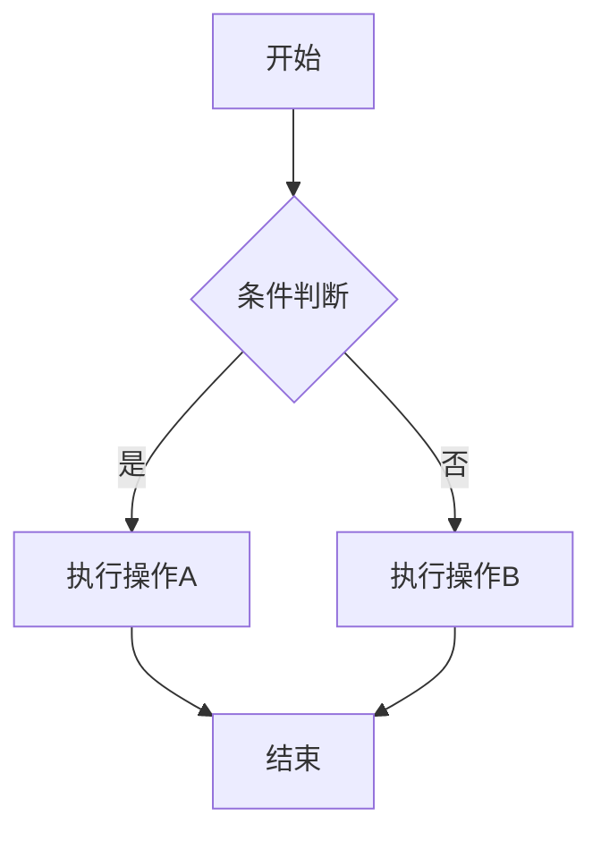
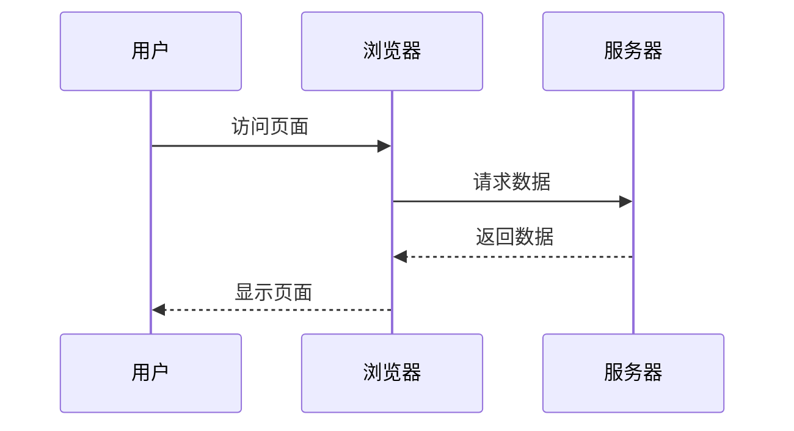
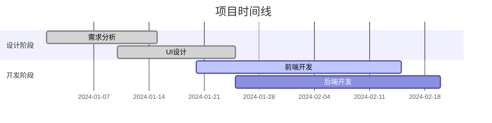

# CopyParty添加Mermaid支持方案

## 当前Markdown渲染实现分析

### 架构概览

CopyParty使用客户端渲染方式处理Markdown文件：

- **服务器端**: 提供Markdown文件内容和渲染页面模板
- **客户端**: 使用JavaScript在浏览器中将Markdown渲染为HTML

### 核心文件结构

```
copyparty/web/
├── md.html          # Markdown渲染页面模板
├── md.js            # Markdown渲染核心逻辑
├── md.css           # Markdown样式
├── md2.js           # Markdown编辑器功能
├── util.js          # 工具函数，包含插件系统
└── deps/
    └── marked.js    # Markdown解析器(包含DOMPurify)
```

### 渲染流程

1. **服务器端处理**
   - 检测`.md`文件请求且包含`?v`参数
   - 调用`tx_md()`方法生成渲染页面
   - 使用Jinja2模板渲染`md.html`

2. **客户端渲染**
   - 加载`marked.js`解析器
   - 调用`convert_markdown()`函数
   - 使用`marked.parse()`生成HTML
   - 处理链接、图片、目录等

### 插件系统

CopyParty支持通过特殊代码块扩展功能：

**预处理插件：**
```copyparty_pre
// 预处理插件代码
```

**后处理插件：**
```copyparty_post
render: function(dom) {
    // 处理渲染后的DOM
}
```

## Mermaid支持实现方案

### 方案一：基于插件系统（推荐快速实现）

**优点**：
- 利用现有插件系统，改动最小
- 用户可选择性启用
- 不影响现有功能

**实现方式**：
在Markdown文件中添加插件代码，然后就可以使用Mermaid图表。

### 方案二：内置支持（推荐长期方案）

**优点**：
- 开箱即用，无需额外配置
- 性能更好，用户体验更佳
- 支持编辑器实时预览

**实现步骤**：
1. 修改构建系统添加Mermaid依赖
2. 修改`md.js`添加Mermaid处理逻辑
3. 更新HTML模板引入Mermaid库
4. 添加CSS样式支持

## 快速实现：插件方式

### 使用方法

1. 在Markdown文件开头添加以下插件代码
2. 然后就可以正常使用Mermaid图表语法

### 插件代码

```copyparty_post
ctor: function() {
    // 加载Mermaid库
    if (!window.mermaid) {
        var script = document.createElement('script');
        script.src = 'https://cdn.jsdelivr.net/npm/mermaid@10.6.1/dist/mermaid.min.js';
        script.onload = function() {
            mermaid.initialize({
                startOnLoad: false,
                theme: document.documentElement.className === 'z' ? 'dark' : 'default',
                securityLevel: 'strict'
            });
            window.mermaidReady = true;
        };
        document.head.appendChild(script);
    }
},

render2: function(dom) {
    // 查找所有mermaid代码块
    var mermaidBlocks = dom.querySelectorAll('pre code.language-mermaid');
    if (mermaidBlocks.length === 0) return;
    
    // 转换代码块为mermaid容器
    for (var i = 0; i < mermaidBlocks.length; i++) {
        var codeBlock = mermaidBlocks[i];
        var preBlock = codeBlock.parentNode;
        var mermaidDiv = document.createElement('div');
        mermaidDiv.className = 'mermaid-diagram';
        mermaidDiv.style.cssText = 'text-align: center; margin: 1em 0; padding: 1em; border: 1px solid #ddd; border-radius: 4px;';
        mermaidDiv.setAttribute('data-mermaid-code', codeBlock.textContent);
        preBlock.parentNode.replaceChild(mermaidDiv, preBlock);
    }
    
    // 渲染图表
    renderMermaidDiagrams();
    
    // 设置主题切换监听
    setupThemeListener();
    
    function renderMermaidDiagrams() {
        if (!window.mermaid || !window.mermaidReady) {
            setTimeout(renderMermaidDiagrams, 100);
            return;
        }
        
        var diagrams = document.querySelectorAll('.mermaid-diagram');
        diagrams.forEach(function(element, index) {
            var code = element.getAttribute('data-mermaid-code');
            try {
                mermaid.render('mermaid-svg-' + index, code, function(svgCode) {
                    element.innerHTML = svgCode;
                });
            } catch (error) {
                element.innerHTML = '<div style="color: red; font-family: monospace;">图表渲染失败: ' + error.message + '</div>';
            }
        });
    }
    
    function setupThemeListener() {
        if (window.mermaidThemeSetup) return;
        window.mermaidThemeSetup = true;
        
        var lightswitch = document.getElementById('lightswitch');
        if (lightswitch) {
            var originalOnClick = lightswitch.onclick;
            lightswitch.onclick = function(e) {
                if (originalOnClick) originalOnClick.call(this, e);
                setTimeout(updateMermaidTheme, 100);
            };
        }
    }
    
    function updateMermaidTheme() {
        if (!window.mermaid) return;
        
        var isDark = document.documentElement.className === 'z';
        mermaid.initialize({
            startOnLoad: false,
            theme: isDark ? 'dark' : 'default',
            securityLevel: 'strict'
        });
        
        // 重新渲染所有图表
        var diagrams = document.querySelectorAll('.mermaid-diagram');
        diagrams.forEach(function(element, index) {
            var code = element.getAttribute('data-mermaid-code');
            try {
                mermaid.render('mermaid-theme-' + index + '-' + Date.now(), code, function(svgCode) {
                    element.innerHTML = svgCode;
                });
            } catch (error) {
                console.error('主题更新失败:', error);
            }
        });
    }
}
```

### 使用示例

添加上述插件代码后，就可以使用各种Mermaid图表：

#### 流程图


#### 时序图


#### 甘特图


## 内置支持实现方案

### 1. 修改构建系统

在`scripts/deps-docker/Dockerfile`中添加：

```dockerfile
ARG ver_mermaid=10.6.1

# 下载并构建mermaid
RUN wget https://registry.npmjs.org/mermaid/-/mermaid-$ver_mermaid.tgz -O mermaid.tgz \
    && tar -xf mermaid.tgz \
    && cd package \
    && npm install \
    && npm run build \
    && cp -pv dist/mermaid.min.js /z/dist/mermaid.js
```

### 2. 修改HTML模板

在`copyparty/web/md.html`中添加：

```html
<script src="{{ r }}/.cpr/deps/mermaid.js?_={{ ts }}"></script>
```

### 3. 修改渲染逻辑

在`copyparty/web/md.js`的`convert_markdown`函数末尾添加：

```javascript
// 处理Mermaid图表
function processMermaidDiagrams(dest_dom) {
    var mermaidBlocks = dest_dom.querySelectorAll('pre code.language-mermaid');
    if (mermaidBlocks.length === 0) return;
    
    // 转换代码块
    for (var i = 0; i < mermaidBlocks.length; i++) {
        var codeBlock = mermaidBlocks[i];
        var preBlock = codeBlock.parentNode;
        var mermaidDiv = document.createElement('div');
        mermaidDiv.className = 'mermaid';
        mermaidDiv.textContent = codeBlock.textContent;
        preBlock.parentNode.replaceChild(mermaidDiv, preBlock);
    }
    
    // 初始化并渲染
    if (window.mermaid && mermaidBlocks.length > 0) {
        var isDark = document.documentElement.className === 'z';
        mermaid.initialize({
            startOnLoad: false,
            theme: isDark ? 'dark' : 'default',
            securityLevel: 'strict'
        });
        mermaid.init();
    }
}

// 在return true之前调用
processMermaidDiagrams(dest_dom);
```

### 4. 添加CSS样式

在`copyparty/web/md.css`中添加：

```css
.mermaid {
    text-align: center;
    margin: 1em 0;
    padding: 1em;
    border-radius: 4px;
}

.mermaid-error {
    color: #d32f2f;
    background: #ffebee;
    border: 1px solid #ffcdd2;
    border-radius: 4px;
    padding: 1em;
    font-family: monospace;
}

/* 暗色主题 */
.z .mermaid-error {
    color: #f44336;
    background: #3e2723;
    border-color: #5d4037;
}
```

## 实施建议

### 第一阶段：插件方式验证
1. 使用插件方式快速验证Mermaid支持
2. 收集用户反馈和使用情况
3. 测试各种图表类型和主题切换

### 第二阶段：内置支持
1. 修改构建系统添加Mermaid依赖
2. 实现内置渲染支持
3. 添加编辑器实时预览功能

### 注意事项

1. **安全性**: 确保Mermaid渲染不会引入XSS风险
2. **性能**: 大型图表可能影响页面加载速度
3. **兼容性**: 测试不同浏览器的兼容性
4. **主题**: 确保明暗主题切换正常工作
5. **插件启用**: 需要启用`emp`标志才能使用插件功能

### 测试方法

1. 创建包含插件代码的Markdown文件
2. 访问时添加`?v`参数进行渲染
3. 测试各种图表类型
4. 验证主题切换功能
5. 检查控制台错误信息
